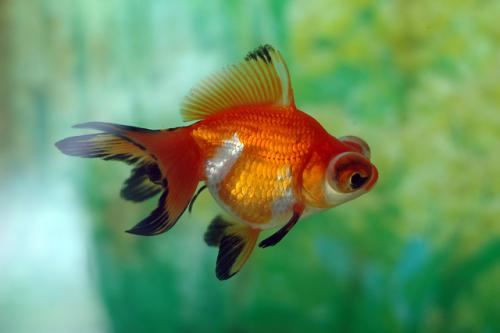
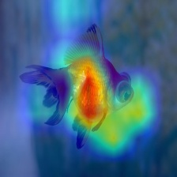

# Easiest code for Grad-Cam Code In Pytorch

## Description

It is a pytorch code for grad-cam. I learned the original paper and write down the code for learning.

Hope more people can learn from this code.

It is the **easiest** code to understand. 

## Requirements

```
pytorch
torchvision
numpy
opencv
```


## Usage

```cmd
python grad_cam.py
```


## Input



## Output



## 

